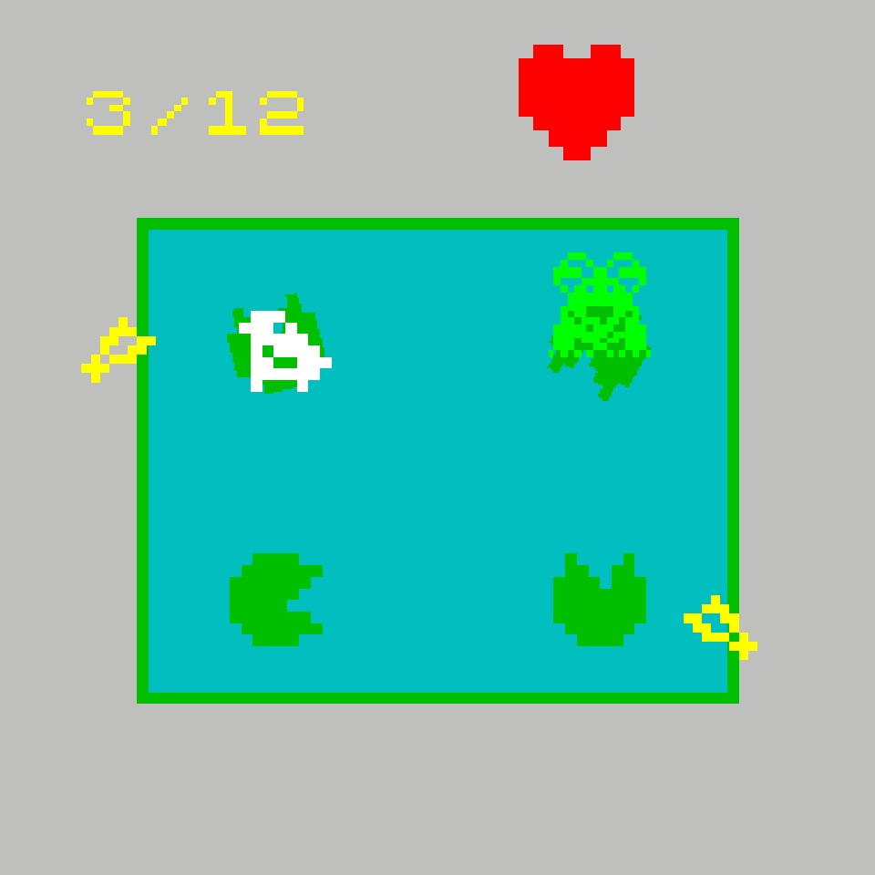
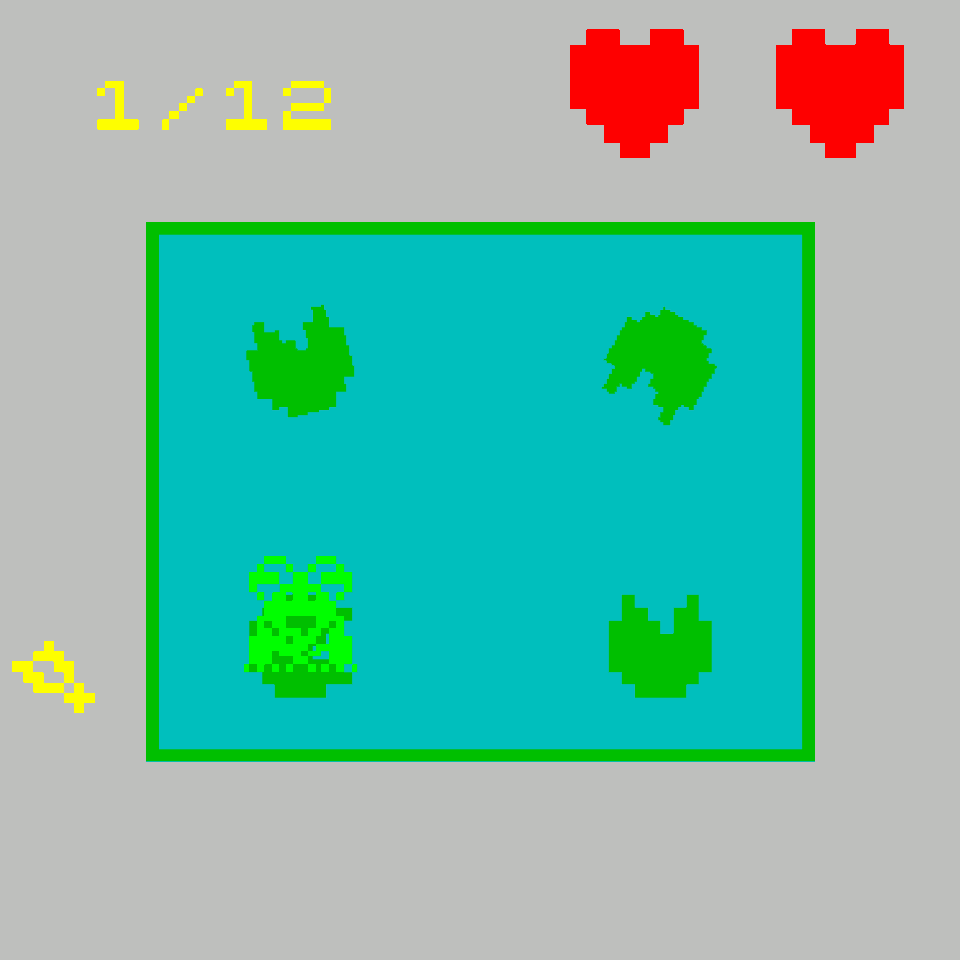
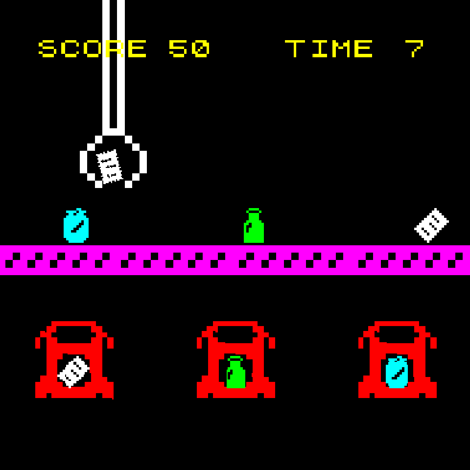
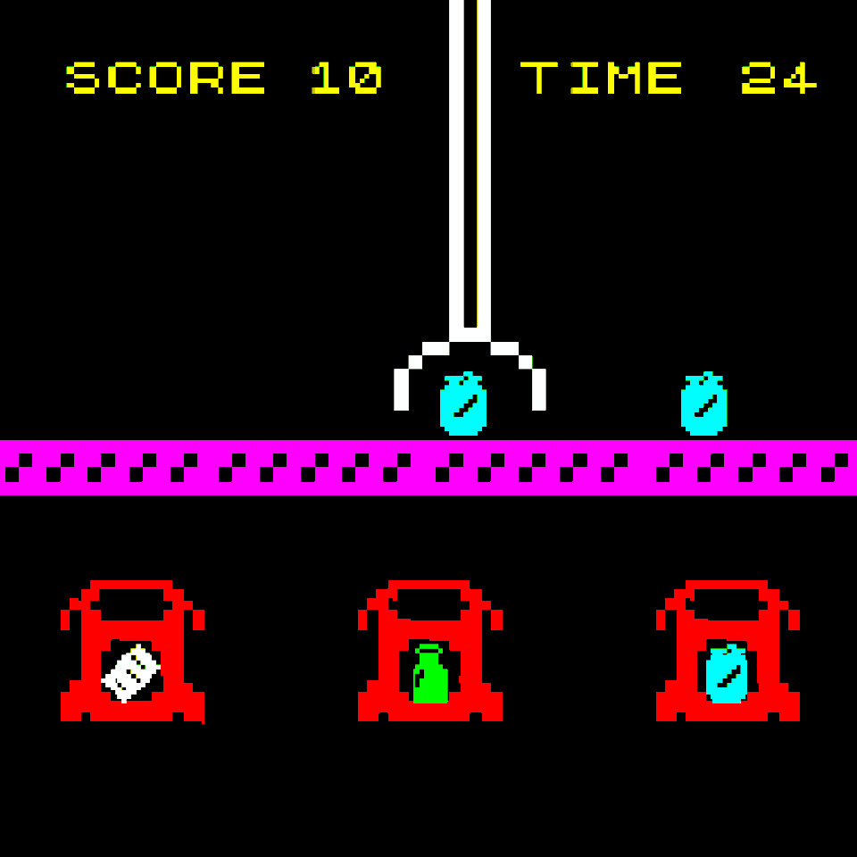
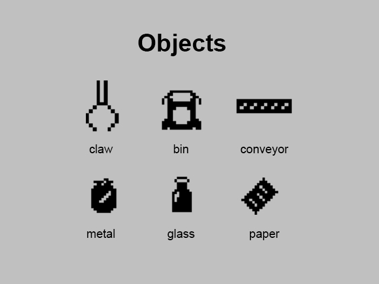
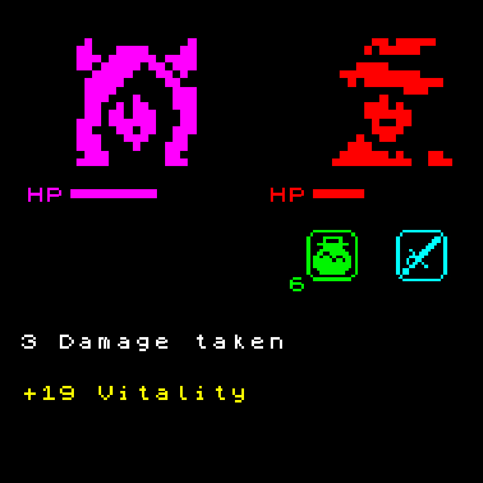
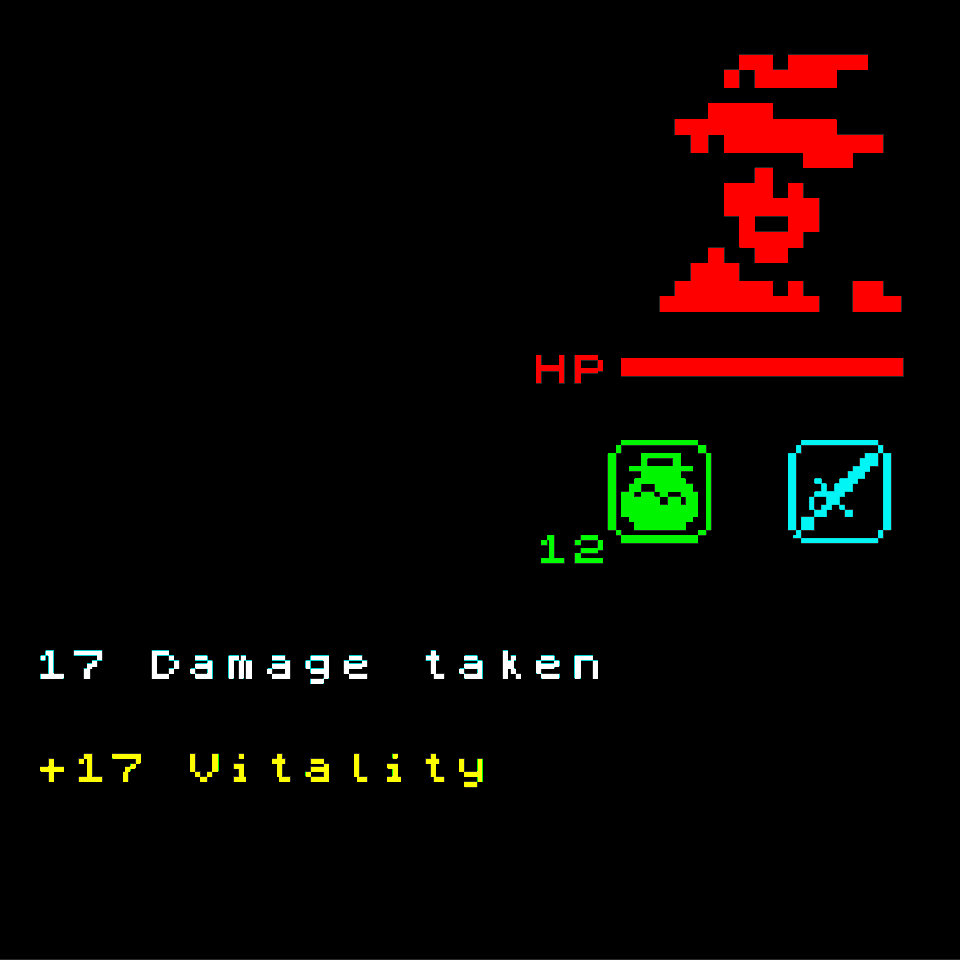
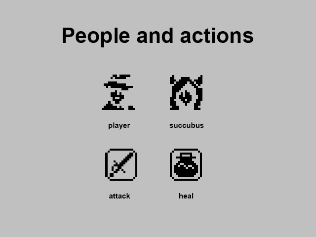
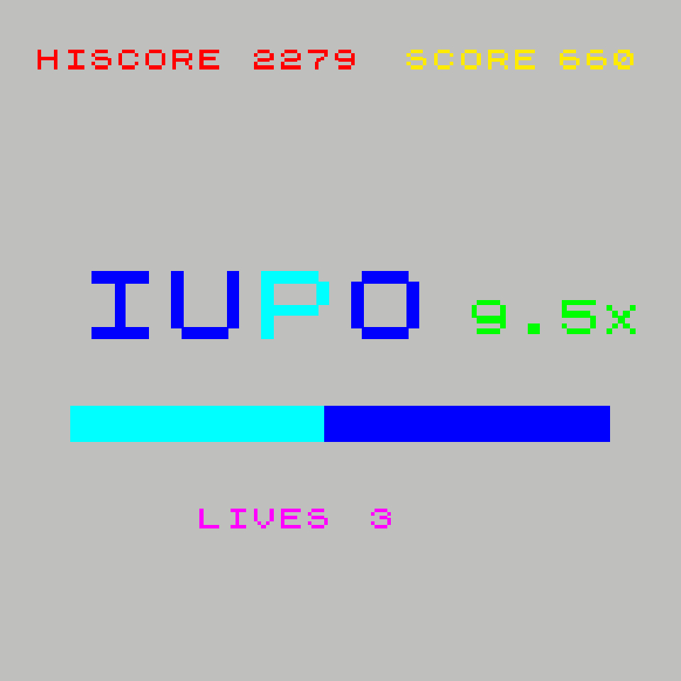
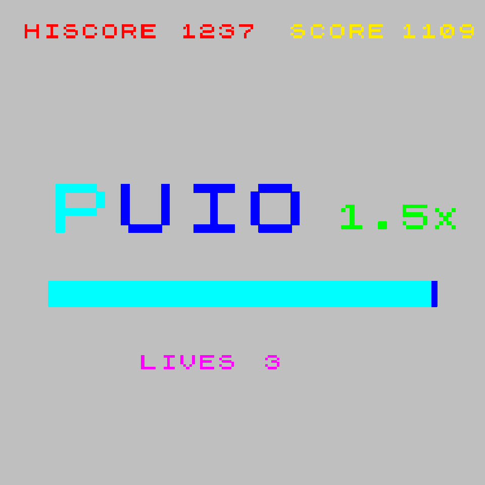

# ZX-Tetrad
### About

ZX Tetrad is an old-school compilation of four original, ZX Spectrum inspired micro-games. 

## Frog
It's a simple, bite-sized game that is perfect for work break boredom. It is played using WASD to move.

I developed this micro-game for Unity Learn's **Junior Programmer Pathway** to demonstrate my ability to implement the four pillars of `Object-Oriented Programming` into a game.

 

## Claw
My micro-game is played by using a keyboard’s WASD keys for positioning the claw together with holding down SPACE to close the claw around items to pick them up.

I present my first project at which point I had functioned as the sole gameplay programmer. This was initially developed within 2022, during my Level 3 extended diploma experience at Sunderland College, with a team consisting of a concept artist and musician. This project allowed me the time to learn how to appropriately employ; `Tags`, `Layers`, `Collision`, and `Triggers` through iterative experimentation. Lasting approximately one month, we were given the assignment theme of recycling where I built it in editor version Unity 2020.3.16f1 and the controls were handled utilising the `Legacy Input Manager`.

You get 60 seconds to grab as much as possible and drop the items into their specific bin to gain points. Furthermore, the sprites were also developed by me and were influenced by The Claw Machine mini-game from Welcome to Willy’s Fun Park! by Hervé Ast.

  

## Dungeon
This can be played using LEFT CLICK on either the heal and or attack button, whereas E on the keyboard is to bring an end to the game without losing.

During my Foundation degree experience provided by The University of Cumbria, in 2025, I was influenced by the dungeon crawler Rondure Sorcerer by JasonTaylor to create my own micro-game based on the turn-based combat observed but with `pseudo-random variables`. Which was excitedly ***reviewed/play tested by 24+ peers with high praise***.

I developed this alone within approximately 3 months using editor version Unity 2022.3.34f1 and I had initially presented this experience to **Critical Path’s Robert Clarke** in addition to **NextGen Skills Academy’s Charlie Blay & Chris Jeffrey**.

The sprites along with the C# scripts were once more developed by myself. Input was handled utilising the `Rewired package made by Guavaman`. Gameplay is endless as once an enemy is defeated, you are rewarded with potions but another enemy will take it’s place.

  

## Type
This project is played by pressing the UIOP keys on a keyboard.

Within my Bachelor of Arts with Honours experience, provided by The University of Cumbria in 2026, I developed a simple yet frustrating micro-game that has the player scrambling to type the corresponding random characters in sequence to gain points before the timer runs out. Said sequence varies in quantity and the timer then restarts upon completion whilst gradually speeding up until the player fails by running out of lives.

Although challenging, it was made necessary for me to learn how to incorporate `lists` into my scripting process in order to generate the random sequence order. Player preferences was also discovered with the objective of storing the player’s score variable to act as the high score.

I made it within editor version Unity 2022.3.34f1, with `Rewired made by Guavaman` (for input management) as well as `LeanTween made by Dented Pixel` (for the countdown animation). Additionally, I pitched this to **Sunderland College lecturers Matthew Lawson-Hall and Tobias Bowery**.

 
